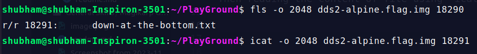

After downloading and decompressing the file using 'gunzip' command.

Using 'mmls' command to see the partitions.

Listing files in root directory using 'fls' command.

Checking files in root directory using its Inode number. Then reading the content of file using 'icat' command.

