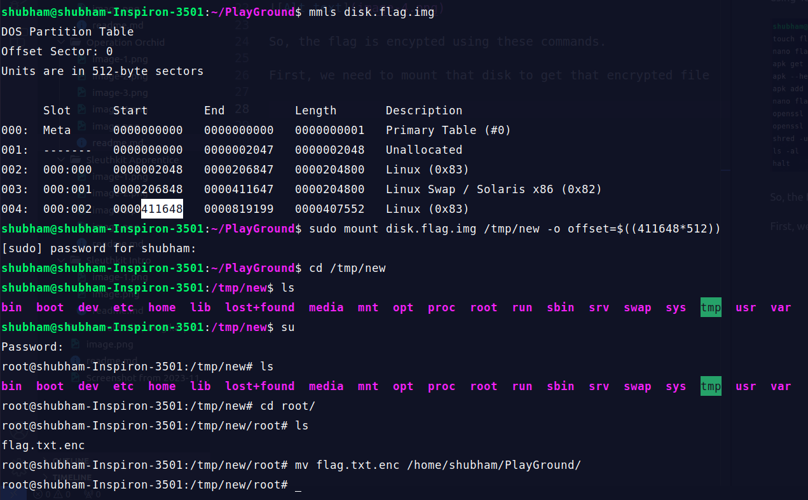

After downloading and decompressing the file using 'gunzip' command.

Using 'mmls' command to see the partitions.

There are 2 Linux (0x83). I am going with the bigger one.

Listing files in root directory using 'fls' command.

Checking files in root directory using its Inode number. 

We can see the flag file is encrypted. Let's check the .ash_history file using 'icat' command.

So, the flag is encypted using these commands.

First, we need to mount that disk to get that encrypted file

Unmount the disk image

Now, we can decrypt the flag. Remember to change the filenames in command

