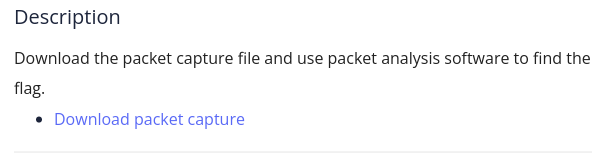

Download the file and open in wireshark or use command: $ wireshark filename

Now, as we know that arp protocol is used for mapping ip address with mac addresses. So, it will not contain the flag so we can filter the packets using filter '!arp'.

From the remainng packets first 3 are used for TCP handshake ignoring that 1 packet using 'PSH' protocol it looks suspicious, looking at that packet we get the flag.

