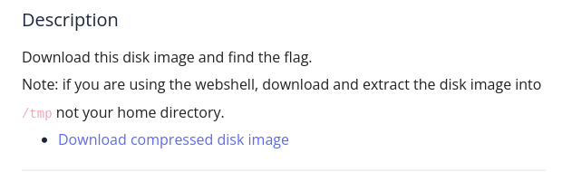
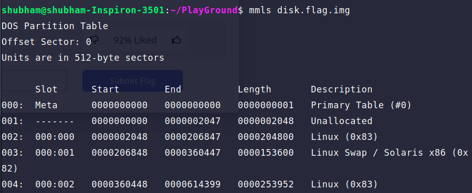
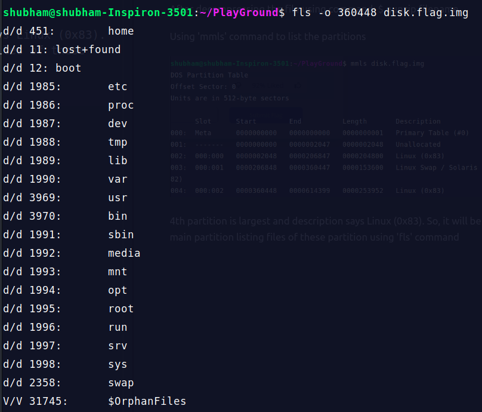
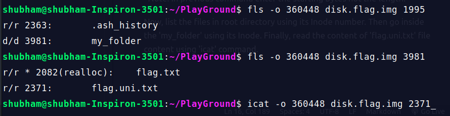

After decompressing the file using command: $ gunzip filename

Using 'mmls' command to list the partitions

4th partition is largest and description says Linux (0x83). So, it will be the main partition listing files of these partition using 'fls' command

*Note: In previous command enter the starting bytes not the length.

Now, list the files in root directory using its Inode number. Then go inside the 'my_folder' using its Inode. Finally, read the content of 'flag.uni.txt' file content using 'icat' command.

We didn't read the content of 'flag.txt' as it realloc means its deleted.

