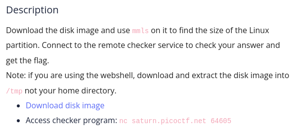
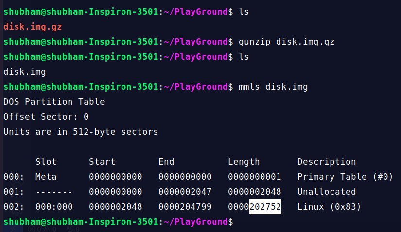

In this challenge after decompressing file using 'gunzip', use mmls command to find the size of the linux partition.

Now, use access checker program using 'nc' command that is already given. Enter the length of linux partition and get the flag.

If you are having trouble understanding this topic use this wonderfull resource: https://primer.picoctf.org/#_disk_analysis