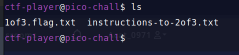

# Magikarp Ground Mission

After starting the instance you will get the ssh command below. Now, you just need to copy and paste that command in terminal and enter the password '6dee9772'.

Using 'ls' command  

We can see 2 files are there. One contains the 1/3 of the flag and other file contains the instructions for 2/3 of the flag.

Read the content of file which contain 1/3 part of the flag using 'cat' command. Then read the instuction to find other parts of flag. 

Now, lets go in the root directory : $ cd /

Again read the content of 2/3 of the flag and then see instruction for 3/3 flag.

Now, lets go in the home directory: $ cd ~

Finally, read the 3/3 of the flag and combine all the flags together.

 
