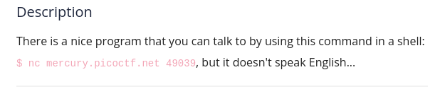
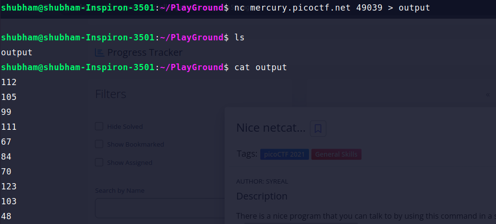
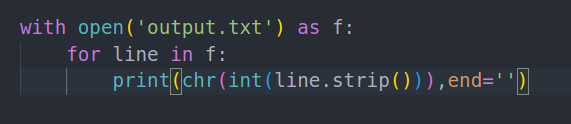
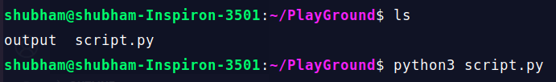

Run the 'nc' command given in challenge decription and save the output in a file. 

The output are ASCII numbers you can also use online ASCII converter. But I am going to create a python script for this

running this script will give you the flag

