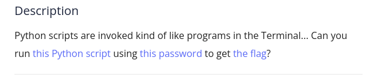
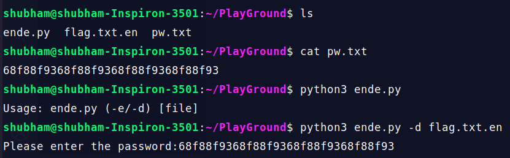

First read the content of file 'pw.txt', this is the password to run the script. Then run the python script. We can see the syntax of using this program. Again run the python file with -d flag and filename then enter the password and you will get the flag.

