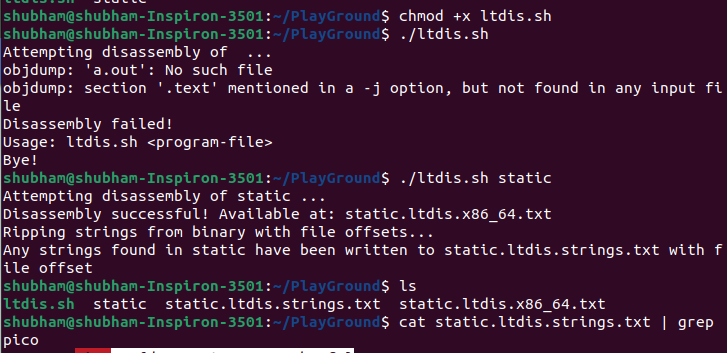

Give execution permission to the 'ltdis.sh' bash script then run the script. Again run the script and pass the file as argument then it will generate some files. read the 'static.ltdis.strings.txt' file and grep the 'pico' text you will get the flag.

