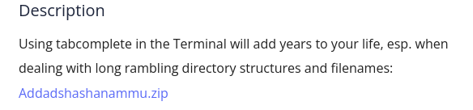
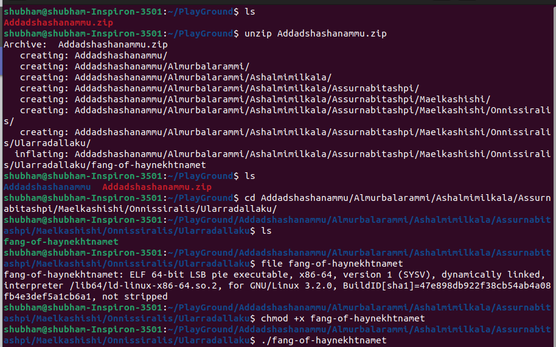

Unzip the file using 'unzip' command. Go inside the directory as much as possible to autocomplete the name use tabs. List the files in current directory and you will see a file check its type using 'file' command. As it is a ELF executable we will give it executable permission and then run it. You will get the flag at last.

