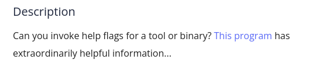

You can check the filetype using 'file' command. It says it is a ELF executable file. We have to give it execute permission using 'chmod' command then run the file. It says pass me a -h(help) flag. After passing the flag you will get the flag

